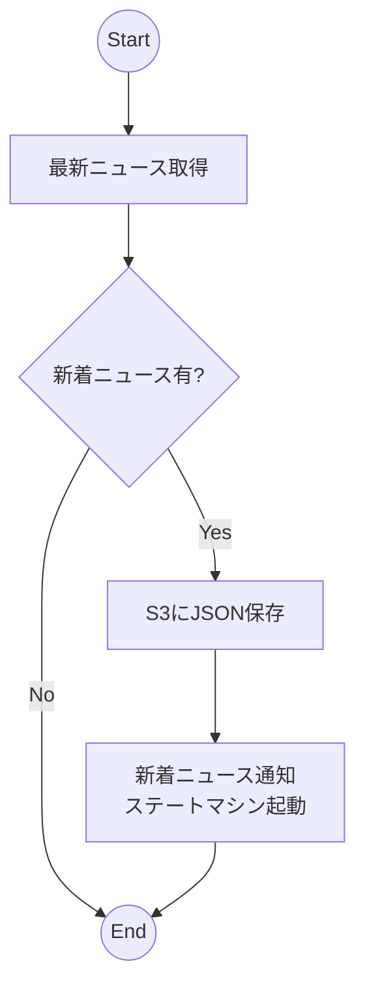
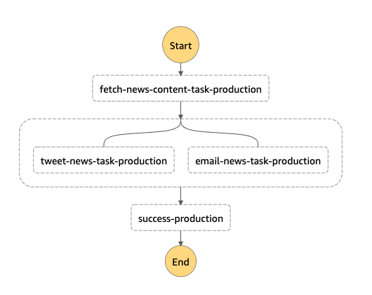

# TmNCT News サーバーレス版

苫小牧高専のニュースをお届けする非公式Bot [苫小牧高専News @TmNCT_News](https://twitter.com/TmNCT_News) のサーバーレス版実装。

## システムの概要

* 最新ニュース取得
    * [苫小牧高専のニュース](https://www.tamukyokai.jp/news/) から最新ニュースを取得
    * Amazon EventBridgeルールで最新ニュース取得Lambdaを定期実行（5分ごと）
    * 最新ニュース取得Lambdaは、最新ニュースを取得し、S3にJSON形式で保存する
* 新着ニュース通知
    * S3のPutObjectイベントをトリガーに、新着ニュース通知ステートマシンを実行する

### 新着ニュース通知ステートマシン

